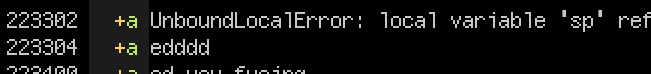

# softchat
* convert twitch/youtube chat into softsubs ([webm](https://ocv.me/dev/softchat.webm))
* supports windows, macos, linux
* MIT-Licensed, 2020-10-12, ed @ irc.rizon.net


# quality
* well-tested, well-regarded software
* check out some of the authentic user feedback below



# howto

* first-time setup (all recommended steps):

      python3 -m pip install --user softchat chat-downloader fugashi[unidic]
      python3 -m unidic download

* download/convert a youtube VOD automatically with https://ocv.me/dev/?ytdl-tui.py

* ...or do it manually like this:

      python3 -m youtube_dl youtube.com/watch?v=4dlsbJiEa-U
      python3 -m chat_downloader --message_groups all -o same-filename.json youtube.com/watch?v=4dlsbJiEa-U
      python3 -m softchat -m2 same-filename.json

  the json filename should be whatever `youtube-dl` decides to use, except replace the extension with `.json` (and remember quotes depending on OS)


# advice

`mpv` is the recommended player, however in danmaku mode, you should resample the video to your monitor's FPS.
* one way to do this: adding the argument `--vf=fps=120` every time
* another way is adding the following line to `input.conf`, which lets you press shift-U to toggle upscaling to 120 fps:
  ```
  U vf toggle fps=120
  ```
* on linux/mac, `input.conf` should be here: `~/.config/mpv/input.conf`
* on windows, `input.conf` should be here: `%appdata%\mpv\input.conf`

additionally, on windows you *may* need to `--vo=direct3d` and *not* fullscreen for resampling to work -- try the different alternatives in `--vo=help` and find one which:
1. doesn't ruin the contrast
2. doesn't make the text blurry
3. doesn't make the text jitter

The fonts produced by `--emote_font` need to be somewhere your media player can see them (either embedded, or in some autoload folder, or installed as system fonts). Set `--emote_install` to install fonts into `~/.config/mpv/fonts/` (Linux/macos) or `%appdata%\mpv\fonts` (windows) for local playback using mpv. For other media players, or if you intend to share the subtitles, you should use `--embed_files` as each font is specific to that particular subtitle file and they need to be used together.

Override automatically vectorized emotes by creating a ".manual.svg" file in the cache directory. So for the emote `UCS9uQI-jC3DE0L4IpXyvr6w_Do6dXuL6LZCQ_AP4-buoDQ` create the file `UCS9uQI-jC3DE0L4IpXyvr6w_Do6dXuL6LZCQ_AP4-buoDQ.manual.svg`. This can be used for emotes where the automatic version is of low quality.

Similarly, rather than using `--emote_fill` to fill the background of all emotes, you can create an empty file named `UCS9uQI-jC3DE0L4IpXyvr6w_Do6dXuL6LZCQ_AP4-buoDQ.bg` to enable bg-fill for just that one emote.


# bugs

* `--emote_sz 3` and higher makes things collide (wontfix probably)


# about

* superchats will display for 2x the time and with inverted colors

* moderator messages are emphasized  
  (larger outline, and prefixed with a ball)

* mode 1, sidebar chat, creates a huge amount of subtitle events  
  which many media players (including mpv) will struggle with

  for example, seeking will take like 5sec

  you can fix this by muxing the subtitle into the vid:  
  `ffmpeg -i the.webm -i the.ass -c copy muxed.mkv`

* mode 2, danmaku, will look blurry and/or jerky in most players  
  unless you have the subtitles render at your native screen res

  for example in mpv you could add these arguments:  
  `--vo=direct3d --sub-delay=-2 --vf=fps=90`

  replace 90 with your monitor's fps

* after an upgrade, you can reconvert old rips like this:  
  `grep -lE '^Title: .*softchat' -- *.ass | tr '\n' '\0' | xargs -0rtl python3 -m softchat -m2 --`

* youtube VOD chatlogs are incomplete (about 80% of messages are lost)  
  so softchat can now take multiple chat JSONs to splice together:  
  it is recommended to run chat_replay_downloader.py twice,  
  first when the stream is live and then afterwards for the VOD chat;  
  when running softchat, the VOD json should be the first file provided,  
  followed by any live recordings to splice messages from

* on windows, `--kana` requires python 3.8 or newer


# dependencies

* chatrips must be made using https://github.com/xenova/chat-downloader
  * softchat will be updated as the output format of chat-downloader changes

* a copy of `NotoSansCJKjp-Regular.otf` in a folder named `noto-hinted`
  * download here: https://ocv.me/stuff/NotoSansCJKjp-Regular.otf
  * or here: https://noto-website-2.storage.googleapis.com/pkgs/Noto-hinted.zip
  * in the future (tm) softchat will require all the Noto-fonts in this folder

* required python libraries: `Pillow fontTools`

* enable `--kana` (convert kanji to hiragana) with these:

      python3 -m pip install --user fugashi[unidic]
      python3 -m unidic download

* enable `--emote_font` with:
  * [fontforge](https://fontforge.org)
  * [ImageMagick](https://imagemagick.org)
  * [potrace](http://potrace.sourceforge.net/)


# maintainers

* build and release: `python setup.py rls`
